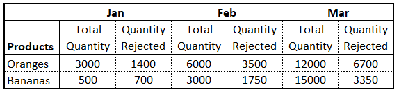

```{css, echo=FALSE}
# CSS for including pauses in printed PDF output (see bottom of lecture)
@media print {
  .has-continuation {
    display: block !important;
  }
}
```

```{r setup, include=FALSE}
options(htmltools.dir.version = FALSE)
library(knitr)
opts_chunk$set(
  fig.align="center",  
  fig.height=4, #fig.width=6,
  # out.width="748px", #out.length="520.75px",
  dpi=300, #fig.path='Figs/',
  cache=T#, echo=F, warning=F, message=F
  )

pacman::p_load(tidyverse, dplyr)
reticulate::repl_python()
# reticulate::install_miniconda()
```


# Workshop preparation

☑ Make sure you have a Gmail account 

☑ Upload and open the `Workshop3_Student.ipynb` file in Google Colab

---

# Overview

**Python I**

  - Google Colab
  - Variable Types - String, Integer, Float, Boolean
  - Lists, Dictionaries, Functions
  
**Python II**

  - Importing libraries in Python
  - Importing files to Google Colab 
  - Working with data and Python packages

---

# Learning Outcomes

- Explain the value of learning Python
- Demonstrate how to work with Google Colab 
- Define lists and dictionaries as it relates to Python
- Access and manipulate data in lists and dictionaries 

---
class: inverse, center, middle
name: motivation

# Motivation

<html><div style='float:left'></div><hr color='#EB811B' size=1px width=796px></html>

---
# Why Python?

- Free
- Open-source
- Has a large community
- Rich ecosystem of third-party packages
- Widely used in industry and academia

---
# Python and R

.pull-left[
**Python**
- General-purpose, object oriented programming
- Can more easily import SQL tables and other data from web
- Well suited for machine learning at scale and integration with web applications

]

.pull-right[
**R**
- Optimized for statistical analysis and data visualization
- Rich libraries for data cleaning, creating visualizations, training and evaluating machine learning and deep learning algorithms
- Strength of MFRE professors and team
]

&nbsp;

.center2[


>  Increasingly, the question isn’t which to choose, but how to make the best use of both programming languages for your specific use cases.

> `r tufte::quote_footer('--- IBM')`

]

.footnote[
[1] [IBM](https://www.ibm.com/cloud/blog/python-vs-r)
]


---

# Why learn one more language? 

```{r, echo = FALSE, out.width = "70%"}

```

---

# Why learn one more language?

```{r, echo = FALSE, out.width = "85%"}
knitr::include_graphics("pics/apps.jpg")
```

---

# Why learn one more language?

- Advanced Excel skills
  - Consultant in Food & Beverage/Agriculture (MNP Consulting)
  - Demand Planner (Semios)
  - Data Research Analyst (Tridge)
  
- Python or R (+ SQL)
  - Data Analyst (Earls Kitchen + Bar, Telus Agriculture)
  - Fleet Analyst (BC Transit)
  - Data Solutions Specialist (BC Public Service)
  - Grocery Data Domain Program Lead (Sobeys)
  - Research Associate (Ocean Wise)

- Tableau or Power BI (or other BI tools)
  - Business Analyst (Telus Health - Agribusiness Enablement & Strategy)
  - Financial Analyst (SPUD.ca)

---
# Programming + more

- But programming skills alone are not enough

.pull-left[
```{r, echo = FALSE, out.width = "90%"}

```
]

.pull-right[
```{r, echo = FALSE, out.width = "100%"}

```
]

---
# Programming + more

- Strong business and economics intuition + verbal and written communication skills + ownership and character 

  - Software as tools 
  - Having strong quantitative, analytical, and programming skills help though😉
  
```{r, echo = FALSE, out.width = "50%"}

```


---
class: inverse, center, middle
name: get_started

# Python I

<html><div style='float:left'></div><hr color='#EB811B' size=1px width=796px></html>

---
# Google Colab

For this workshop and the Analytics course next semester, we will use [Google Colab](https://colab.research.google.com/). 

  - All you need is a working Gmail account
  - No need to install any software 
  - Works on Windows and MacOS
  - Can easily share codes with colleagues

Keyboard shortcuts
  - `Ctrl + Enter` to run
  - `Ctrl + M + B` to insert code chunk
  - `Ctrl + /` to comment out a code chunk (+ `Cmd` for Mac)
  
---
# Participation

You are expected to fill in the Google Colab file. 

At the end of the workshop, share this file to my UBC email.

**Share -> Change from "Restricted" to "Anyone with the link" -> Share with my UBC email**

---
# Try it out

```{python}
2 + 2
print("Hello World")

```

---
# Strings, integers, and floats

In Python, the assignment operator is `=`. 

To review the value of a variable, we can type the name of the variable into the interpreter and press Enter/Return. 

However, to display output in a script, we have to use the `print` function. 

```{python}
text = "Data Carpentry"
number = 42
pi_value = 3.1415

text
print(number)
```


---
# Strings, integers, and floats

Everything in Python has a type. To get the type of something, we can pass it to the built-in function `type`

  - **Strings** hold sequences of characters, which can be letters, numbers, punctuation, etc.
  - **Integers** are positive or negaitve whole numbers with no decimal points
  - **Floats** are real numbers and can be written with a decimal point

```{python}
type(text)
```

```{python}
type(number)
```

```{python}
type(pi_value)
```

---
# Operators

We can perform mathematical calculations in Python using basic operators `+, -, /, *, %`

```{python}
2 + 2 # Addition

6 * 7 # Multiplication

2 ** 16 # Power

13 % 5 # Modulo

```

---

# Logic Operators

We can also use comparison and logic operators: `<, >, ==, !=, <=, >=` and statements of identity such as `and, or, not`. The data type returned is called **boolean**.

```{python}
3 > 4 

True and True

True or False

True and False
```

---
# Lists

**Lists** are the most fundamental data structure in Python. It is used to hold an ordered sequence of elements.

We build a list using **square brackets**.

```{python}
country = ["canada", "usa", "china", "japan"]
gdp = [44100, 55700, 16200, 39300]
carbon = [15.3, 16.6, 7.06, 9.14]

country
type(country)
len(country)
```

---
# Lists

Lists can also contain different data types. Lists can also contain lists. 

```{python}
example1 = ["canada", 15.3, "usa", 16.6, "china", 7.06, "japan", 9.14]

example2 = [["canada", 15.3],
            ["usa", 16.6],
            ["china", 7.06],
            ["japan", 9.14]]
            
print(example1)

print(example2)
print("length of example2:", len(example2))
```

---
# Lists

Each element in a list can be accessed by an index. **Note that Python indexes start with 0 instead of 1.**

```{python}
example1 = ["canada", 15.3, "usa", 16.6, "china", 7.06, "japan", 9.14]

example2 = [["canada", 15.3],
            ["usa", 16.6],
            ["china", 7.06],
            ["japan", 9.14]]
            
print("China's carbon emissions is", example1[5])
print("Japan's carbon emissions is", example2[3][1])
```

---
# Lists

We can also slice lists, or select multiple elements from a list. In general, where it starts is included, where it ends is excluded, i.e., `[start_index:end_index]`. 

```{python}
example1 = ["canada", 15.3, "usa", 16.6, "china", 7.06, "japan", 9.14]

print(example1[2:6])
print(example1[:4])
print(example1[4:])
```

How do you print China's and Japan's emission only using data from `example2`?

---
# Lists

To print the index of a certain value in a list, we can use the `.index` function

```{python}
print("The index of 7.06 is", example1.index(7.06))
```

---
# Lists

We can also change the value of the elements in a list. For example, we can change the value of Canada's emission from 15.3 to 16.3.

```{python}
example1 = ["canada", 15.3, "usa", 16.6, "china", 7.06, "japan", 9.14]

example1[1] = 16.3

print(example1)
```

---
# Lists

If we want to replace the values in Canada's entries with South Korea's emissions:

```{python}
example1 = ["canada", 15.3, "usa", 16.6, "china", 7.06, "japan", 9.14]

example1[0:2] = ["south korea", 12.9]

print(example1)
```

---
# Lists

If we want to add Canada to the list again:

```{python}
example1_can = example1 + ["canada", 15.3]

print(example1_can)
```

---
# Lists

We can delete elements using the `del` function. For example, we can delete South Korea from our list.

```{python}
example1_can_append = ["south korea", 12.9, "usa", 16.6,
                      "china", 7.06, "japan", 9.14, "canada", 15.3]

del(example1_can_append[0:2])
print(example1_can_append)
```

---
# Lists

We can also take the sum of elements in a list using the `sum` function.

```{python}
carbon = [15.3, 16.6, 7.06, 9.14]

print(sum(carbon))
```

---
# Lists

We can use a `for` loop to access the elements in a list one at a time:

```{python}
carbon = [15.3, 16.6, 7.06, 9.14]

for emissions in carbon:
  print(emissions)
```

---
# Dictionaries

Another important data type is called the **dictionary**. It is a container that holds pairs of objects - keys and values. 

Let's say you want to track the carbon emissions of each of these four countries. 

```{python}
country = ['canada', 'usa', 'china', 'japan']
carbon = [15.3, 16.6, 7.06, 9.14]

usa_index = country.index('usa')
print(usa_index)
print('usa emissions: ', carbon[usa_index])
```

---
# Dictionaries

This method, however, can be time consuming especially if you have a very big dictionary.

Dictionaries allow us to connect each country directly to its emissions. 

To create a dictionary, we use **curly brackets**. 

Inside these curly brackets are a bunch of **key:value** pairs, where keys are countries and values are carbon emissions. 

---
# Dictionaries

Dictionaries work a lot like lists, except that you index them with **keys** instead of an index number.

To access a value of a given key, simply type in `data['key']`.

```{python}
emissions = {
  'canada': 15.3, 
  'usa':16.6,
  'china':7.06,
  'japan':9.14
}

emissions['china']
```

---
# Dictionaries

For the lookup to work properly, keys in the dictionary must be unique. 

In this example, the last key:value pair for China was stored in the dictionary. 

```{python}
emissions = {
  'canada': 15.3, 
  'usa':16.6,
  'china':7.06,
  'japan':9.14,
  'china':15
}


print(emissions)
```

---
# Dictionaries

To add an item to a dictionary, we assign a value to a new key.

```{python}
emissions['south korea'] = 12.9

print(emissions)
```

We can also update the value of an existing key

```{python}
emissions['south korea'] = 15

print(emissions)
```

We use the `del` function to delete a key:value pair.

```{python}
del(emissions['south korea'])

print(emissions)
```
---
# Dictionaries

Dictionaries can contain key:value pairs where the values are again dictionaries, just like lists can also contain lists. 

In this example, the keys are still country names, but the values are GDP and carbon emissions.

```{python}
data = {
  'canada': {'gdp':44100,
            'carbon':15.3},
  'usa': {'gdp':55700,
          'carbon':16.6}
}

# To print Canada's emissions
print(data['canada']['carbon'])
```


---
# Dictionaries

To add China's GDP and emissions to the `data` dictionary we just created

```{python}
data = {
  'canada': {'gdp':44100,
            'carbon':15.3},
  'usa': {'gdp':55700,
          'carbon':16.6}
}

china_data = {'gdp':16200, 'carbon':7.06}

#Add China to data
data['china'] = china_data

```

---
# Dictionaries

Using `for` loops with dictionaries is a little more complicated. 

1) Method 1

```{python}
data = {'canada': {'gdp': 44100, 'carbon': 15.3}, 
        'usa': {'gdp': 55700, 'carbon': 16.6}, 
        'china': {'gdp': 16200, 'carbon': 7.06}}

for key, value in data.items():
  print(key, "->", value)
```

---
# Dictionaries

2) Method 2

```{python}
data = {'canada': {'gdp': 44100, 'carbon': 15.3}, 
        'usa': {'gdp': 55700, 'carbon': 16.6}, 
        'china': {'gdp': 16200, 'carbon': 7.06}}
      
for key in data.keys():
  print(key, "->", data[key])
```

---
# Functions

A **function** is a code chunk that runs when is called. You can pass inputs called **parameters** or **arguments** into a function and get a result back. 

Defining a section of code as a function in Python is done using the `def` keyword. 

---
# Functions 

In the example below, we have a function called `my_function` that takes one argument `fname`. When `my_function` is called, we pass along a first name, which is used inside the function to print the student name. 

```{python}
def my_function(fname):
  print("Hello " + fname + ". Welcome to class today!")
  
my_function("Krisha")
my_function("Janelle")
```

.footnote[
[1] [W3 Schools Tutorial](https://www.w3schools.com/python/python_functions.asp) 
]

---
# Functions

By default, a function must be called with the correct number of arguments. Meaning, if your function expects 2 arguments, you have to call the function with 2 arguments, not more and not less.

```{python}
def my_function(fname, lname):
  print("Hello " + fname + " " + lname + "!")
  
my_function("Krisha", "Lim")
```

Try running this code. What do you get?

```{python, eval = F}
my_function("Janelle")
```

.footnote[
[1] [W3 Schools Tutorial](https://www.w3schools.com/python/python_functions.asp) 
]

---
# Functions

Here is an example of a function named `add_function` that takes two arguments and returns their sum:

```{python}
def add_function(a, b):
  result = a + b
  print(result)

add_function(20, 22)
```

.footnote[
[1] [W3 Schools Tutorial](https://www.w3schools.com/python/python_functions.asp) 
]

---
# Case Study

Kim has been asked to use Python to analyze the following dataset. 

```{r, echo = FALSE, out.width = "70%"}

```

Specifically, her tasks are:
- Create one or more Python "dictionaries" for all data in the above table (Hint: You can use nested dictionaries for fruits and quantity/rejected, and use lists to hold the values)
- Print fruit dictionary
- Print the sum of all "Orange" Total Quantity and sum of all "Orange" Quantity Rejected
- Calculate and print the rejection rate
- Calculate and print the maximum of "Orange" Total Quantity (Hint: use `max()` function)

---
  # Case Study - Suggested Solutions
  
  - Create fruit dictionary

```{python}
fruit = {'oranges': {'quantity': [3000, 6000, 12000],
  'rejected': [1400, 3500, 6700]},
  'bananas': {'quantity': [500, 3000, 15000],
    'rejected': [700, 1750, 3350]}}

```

- Print fruit dictionary

```{python, eval = F}
print(fruit)              
```

---
  # Case Study - Suggested Solutions
  
  - Print the sum of all "Orange" Total Quantity and sum of all "Orange" Quantity Rejected

```{python}
print("Quantity = ", sum(fruit['oranges']['quantity']))
print("Rejected = ", sum(fruit['oranges']['rejected']))
```

---
  # Case Study - Suggested Solutions
  
  - Calculate and print the rejection rate

```{python}
orange_totalqty = sum(fruit['oranges']['quantity'])
orange_totalrej = sum(fruit['oranges']['rejected'])
orange_rejrate = orange_totalrej / orange_totalqty

# use round() to round to 2 decimal places only
print("Orange rejection rate = ", round(orange_rejrate, 2))
```

---
  # Case Study - Suggested Solutions
  
  - Calculate and print the maximum of "Orange" Total Quantity (Hint: use `max()` function)

```{python}
fruit = {'oranges': {'quantity': [3000, 6000, 12000],
  'rejected': [1400, 3500, 6700]},
  'bananas': {'quantity': [500, 3000, 15000],
    'rejected': [700, 1750, 3350]}}

print("Orange max qty =", max(fruit['oranges']['quantity']))
```


---
# Reminder

- Share your Colab file to my UBC email.

**Share -> Change from "Restricted" to "Anyone with the link" -> Share with my UBC email**


---
# Recap

- Explain the value of learning Python
- Demonstrate how to work with Google Colab 
- Define lists and dictionaries as it relates to Python
- Access and manipulate data in lists and dictionaries 

---
# Python II

- Next Monday, November 15
- Topics:

  - Importing libraries in Python
  - Importing files to Google Colab 
  - Working with data and Python packages
  
---
# References

- [Data Analysis and Visualization in Python for Ecologists](https://datacarpentry.org/python-ecology-lesson/00-before-we-start/index.html) by Data Carpentry


```{r convert, include = F}
# library(xaringanBuilder)
# 
# build_pdf("C:/Users/krishlim/OneDrive - UBC/Desktop/mfre/2021w-python-bootcamp/presentation/workshop3.html")
# pagedown::chrome_print("C:/Users/krishlim/OneDrive - UBC/Desktop/mfre/2021w-python-bootcamp/presentation/workshop3.Rmd")
```
